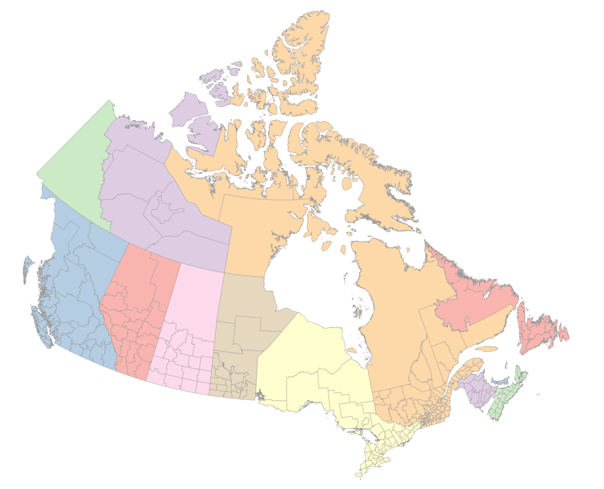

# canmap

## @kjhealy

Classroom example. Downloading a map of Canada (with Census district boundaries), reading into R, converting to 
GeoJSON format, and then using as a simple features (`sf`) object. 

